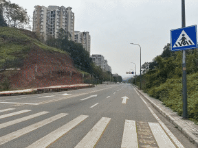

## RWIDE: A Real-World Image Dehazing Dataset
> ###### [Overview](#rwide-a-real-world-image-dehazing-dataset) | [Download](#download) | [License](#license) 
>
> <a href="LICENSE"></a>&nbsp; <a href="https://sites.google.com/site/xiangtaooo/home"></a>&nbsp;

This repository contains the dataset and additional resources of the paper "*RWIDE: A Real-World Image Dehazing Dataset*". The datasheet for our dataset is available in this repository as a *PDF* file. 



Image dehazing, producing clear images from hazy ones, is a crucial yet intrinsically challenging endeavor. However, existing natural-haze image datasets lack diversity and an adequate number of hazy and haze-free image pairs. Dehazing natural-haze images is especially arduous due to the intricate haze distribution and distinctive optical effects, and current research frequently depends on synthetic- or artificial-haze data, thereby constraining their relevance to real-world scenarios. To fill this gap, in this paper, we introduce a **R**eal-**W**orld **I**mage **DE**hazing dataset (**RWIDE**), the first large-scale hazy image dataset with multi-scene annotations that contains 2,455 image pairs.  Our RWIDE dataset is divided into RWIDE-α and RWIDE-β, with the latter containing three subdatasets: RWIDE-β1, RWIDE-β2, and RWIDE-β3.

**RWIDE-α dataset**<br>
Image pairs in RWIDE-α are manually captured using the *ProRAW Max* format of an Apple iPhone 15 Pro. We select Chongqing, China, as our location for capturing natural-haze images. Nestled among mountains and positioned at the confluence of the Yangtze and Jialing Rivers, the city provides optimal high-humidity conditions for data acquisition. 

**RWIDE-β dataset**<br>
Image pairs in RWIDE-β are handpicked from static webcams worldwide, which are sourced from freely available and legal websites . It consists of three subdatasets. RWIDE-β1 includes image pairs with varying haze depths, where each haze-free scene corresponds to three different haze scenes. RWIDE-β2 contains hazy images of single depth, with one haze scene per haze-free scene. RWIDE-β3 is designed for road environments. It includes various hazy road scenes, such as urban roads, rural roads, highways, etc. Additionally, RWIDE-β has thoroughly eliminated disruptive image content like website logos and icons.


We have invested significant effort into collecting image pairs depicting various road environments, such as urban roads, rural roads, highways, forest roads, leisure trails, community roads, bends, tunnel entrances, roundabouts, zebra crossings, and other environments.


## Annotation details

Each image pair in RWIDE is accompanied by annotations. These annotations categorize various scene types based on two criteria. (1) Ground scene classification is based on the area where the haze occurs. Haze exhibits diverse formations and distributions across various scenes, resulting in distinctive hazy landscapes. (2) Sky scene classification relies on haze-free image sky statuses. The sky region presents unique characteristics as it lacks obstructed objects typically caused by haze. Neglecting this distinctiveness may introduce noise and artifacts. Note that images can have multiple annotation labels in scene classification, indicating the presence of multiple scene elements.

**Ground scene classification**<br>The ground scenes in RWIDE are categorized into six groups: Mountains and Hills (MH), Lakes and Rivers (LR), Forests and Jungles (FJ), Buildings and Cityscape (BC), Roadscape (RS), and Snowscape (SS). <br>


**Sky scene classification** <br>The skies depicted by haze-free images in RWIDE are classified into five types:  No Sky Visible (NSV), Overcast with a Clear Sky (OCS), Sunny with a Clear Blue Sky (SCBS), Overcast with a Cloudy Sky (OCCS), and Sunny with a Blue Sky and some Clouds (SBSC).


Ground scene classifications exhibit interdependence owing to overlap. A "1" label is assigned when specific scene elements are present; otherwise, it's labeled "0". In contrast, sky scene classification remains independent. Annotation information for all images can be found in the provided annotation files (.*csv*).

## Download

You can download the  **[RWIDE](https://sites.google.com/site/xiangtaooo/home)** dataset including annotation files  (~2.70 GB) .

## Directory Structure

The dataset we provide does not contain any offensive content. We, the authors, bear all responsibility for withdrawing our paper and data in case of violating licensing or privacy rights and for confirming the data license. The curated data is organized as below:

```text
/RWIDE
├── annotations
│   └── annotations-RWIDE-alpha.csv
├── RWIDE-alpha
│   ├── clear
│   │   ├── 001.jpg
│   │   └── 002.jpg
│   ├── hazy
│   │   ├── 001.jpg
│   │   └── 002.jpg
│   └── hazy_align
│       ├── 001.jpg
│       └── 002.jpg
└── RWIDE-beta
    ├── RWIDE-beta1
    │   ├── clear
    │   │   ├── 001.jpg
    │   │   └── 002.jpg
    │   ├── hazy
    │   │   ├── 001_01.jpg
    │   │   ├── 001_02.jpg
    │   │   ├── 001_03.jpg
    │   │   └── 002_01.jpg
    │   └── hazy_align
    │       ├── 001_01.jpg
    │       ├── 001_02.jpg
    │       ├── 001_03.jpg
    │       └── 002_01.jpg
    ├── RWIDE-beta2
    │   ├── clear
    │   │   ├── 001.jpg
    │   │   └── 002.jpg
    │   ├── hazy
    │   │   ├── 001.jpg
    │   │   └── 002.jpg
    │   └── hazy_align
    │       ├── 001.jpg
    │       └── 002.jpg
    └── RWIDE-beta3
        ├── clear
        │   ├── 001.jpg
        │   └── 002.jpg
        ├── hazy
        │   ├── 001.jpg
        │   └── 002.jpg
        └── hazy_align
            ├── 001.jpg
            └── 002.jpg
```

- [`annotations/*.csv`]()

  Four annotation files in *CSV* format with the following naming convention:

  `annotations-RWIDE-{SUB_NAME}.csv`

  - `{SUB_NAME}` - name of the subdataset.

  *CSV* file with the following structure:

  | Image Name |  MH  |  LR  |  FJ  |  BC  |  RS  |  SS  | NSV  | OCS  | OCCS | SCBS | SBSC |
  | :--------: | :--: | :--: | :--: | :--: | :--: | :--: | :--: | :--: | :--: | :--: | :--: |

- [`RWIDE-{SUB_NAME}/{TYPE_NAME}`]()

  Four subdatasets with the following naming convention:

  - `{SUB_NAME}` - name of the subdataset,
  - `{TYPE_NAME}` - name of the image type (*clear*, *hazy*, and *hazy_align*).

- [`RWIDE-{SUB_NAME}/{TYPE_NAME}/*.jpg`]()

  Images in *JPG* format with the following naming convention:

  `{IMAGE_NAME}.jpg`

  `{IMAGE_NAME}_{ID}.jpg` (when the folder is '*RWIDE-beta1/hazy*' or '*RWIDE-beta1/hazy_align*')

  - `{IMAGE_NAME}` - name of the images ranges from '*001*' to '*max_number*',
  - `{ID}` - index of the haze depth ('01', '02' or '03').

## Why make this?

Image dehazing is a crucial yet intrinsically challenging endeavor, focused on producing clear images from hazy ones. However, existing natural-haze image datasets lack diversity and an adequate number of hazy and haze-free image pairs. Dehazing natural-haze images is especially arduous due to the intricate haze distribution and distinctive optical effects, and current research frequently depends on synthetic or artificial-haze data, thereby constraining their relevance to real-world scenarios. To the best of our knowledge, RWIDE is the first real-world hazy image dataset with annotations for multiple scenes, which can promote further research on image restoration and dehazing tasks.

## How can I use this?

The dataset can be downloaded from the provided link. During training, validation, and inference, simply normalize in your PyTorch DataLoader as typically done in most image dehazing models. It's worth noting that diverse shooting angles yield varied hazy image effects within the same scene. RWIDE primarily documents haze from ground-level photography and fixed webcams or surveillance cameras, which could limit model applicability to other perspectives like indoor or remote sensing scenarios. We encourage future researchers to expand this dataset by collecting data from other shooting perspectives to enhance its richness and applicability.

## Who created this dataset?

The dataset is created by the authors of the paper as well as the members of the Image Processing and Security Laboratory at Chongqing University.

## License

Copyright (c) 2024 Image Processing and Security Laboratory

The relevant codes is licensed under the MIT License. This dataset is licensed under the Creative Commons Attribution-NonCommercial-ShareAlike 4.0 International (CC BY-NC-SA 4.0). This license requires that reusers give credit to the creator. It allows reusers to distribute, remix, adapt, and build upon the material in any medium or format, for noncommercial purposes only. If others modify or adapt the material, they must license the modified material under identical terms.

All DHAs adheres to the license of the original authors. You can find the original source codes and their respective licenses for LGP, SLP, Light-DehazeNet (LD),  DehazeFormer (DF), PSMB and C2P in the links below.

| Year | Title                                                        | DHA  | Paper                                                        | Code                                                         |
| ---- | ------------------------------------------------------------ | ---- | ------------------------------------------------------------ | ------------------------------------------------------------ |
| 2021 | Multi-scale single image dehazing using Laplacian and Gaussian pyramids | LGP  | <a href="https://ieeexplore.ieee.org/stampPDF/getPDF.jsp?tp=&arnumber=9606591&ref=aHR0cHM6Ly9pZWVleHBsb3JlLmllZWUub3JnL2Fic3RyYWN0L2RvY3VtZW50Lzk2MDY1OTE="></a> | <a href="https://github.com/zhengchaobing/Multi-scale-Single-Image-Dehazing-Using-Laplacian-and-Gaussian-Pyramids"></a> |
| 2023 | Single Image Dehazing Using Saturation Line Prior            | SLP  | <a href="https://ieeexplore.ieee.org/stampPDF/getPDF.jsp?tp=&arnumber=10141557&ref=aHR0cHM6Ly9pZWVleHBsb3JlLmllZWUub3JnL2Fic3RyYWN0L2RvY3VtZW50LzEwMTQxNTU3"></a> | <a href="https://github.com/LPengYang/Saturation-Line-Prior"></a> |
| 2021 | Light-DehazeNet: a novel lightweight CNN architecture for single image dehazing | LD   | <a href="https://ieeexplore.ieee.org/stampPDF/getPDF.jsp?tp=&arnumber=9562276&ref=aHR0cHM6Ly9pZWVleHBsb3JlLmllZWUub3JnL2Fic3RyYWN0L2RvY3VtZW50Lzk1NjIyNzY="></a> | <a href="https://github.com/hayatkhan8660-maker/Light-DehazeNet"></a> |
| 2023 | Vision transformers for single image dehazing                | DF   | <a href="https://ieeexplore.ieee.org/ielx7/83/9991910/10076399.pdf?tp=&arnumber=10076399&isnumber=9991910&ref=aHR0cHM6Ly9pZWVleHBsb3JlLmllZWUub3JnL2Fic3RyYWN0L2RvY3VtZW50LzEwMDc2Mzk5"></a> | <a href="https://github.com/IDKiro/DehazeFormer"></a> |
| 2023 | Partial Siamese with Multiscale Bi-codec Networks for Remote Sensing Image Haze Removal | PSMB | <a href="https://ieeexplore.ieee.org/stampPDF/getPDF.jsp?tp=&arnumber=10268954&ref=aHR0cHM6Ly9pZWVleHBsb3JlLmllZWUub3JnL2Fic3RyYWN0L2RvY3VtZW50LzEwMjY4OTU0"></a> | <a href="https://github.com/thislzm/PSMB-Net"></a> |
| 2023 | Curricular contrastive regularization for physics-aware single image dehazing | C2P  | <a href="https://openaccess.thecvf.com/content/CVPR2023/papers/Zheng_Curricular_Contrastive_Regularization_for_Physics-Aware_Single_Image_Dehazing_CVPR_2023_paper.pdf"></a> | <a href="https://github.com/Polaris-F/C2PNet"></a> |

Likewise, you can find all referenced hazy image datasets and their respective licenses at the link below.

| Year | Title                                                        | Dataset      | Paper                                                        | Download                                                     |
| ---- | ------------------------------------------------------------ | ------------ | ------------------------------------------------------------ | ------------------------------------------------------------ |
| 2018 | Benchmarking single-image dehazing and beyond                | RESIDE (OTS) | <a href="https://ieeexplore.ieee.org/stamp/stamp.jsp?tp=&arnumber=8451944"></a> | <a href="https://sites.google.com/view/reside-dehaze-datasets/reside-%CE%B2"></a> |
| 2018 | O-HAZE: a dehazing benchmark with real hazy and haze-free outdoor images | O-HAZE       | <a href="chrome-extension://ikhdkkncnoglghljlkmcimlnlhkeamad/pdf-viewer/web/viewer.html?file=https%3A%2F%2Fopenaccess.thecvf.com%2Fcontent_cvpr_2018_workshops%2Fpapers%2Fw13%2FAncuti_O-HAZE_A_Dehazing_CVPR_2018_paper.pdf#=&zoom=220.00000000000003"></a> | <a href="https://data.vision.ee.ethz.ch/cvl/ntire18//o-haze/"></a> |
| 2020 | NH-HAZE: an image dehazing benchmark with non-homogeneous hazy and haze-free images | NH-HAZE      | <a href="chrome-extension://ikhdkkncnoglghljlkmcimlnlhkeamad/pdf-viewer/web/viewer.html?file=https%3A%2F%2Fopenaccess.thecvf.com%2Fcontent_CVPRW_2020%2Fpapers%2Fw31%2FAncuti_NH-HAZE_An_Image_Dehazing_Benchmark_With_Non-Homogeneous_Hazy_and_Haze-Free_CVPRW_2020_paper.pdf#=&zoom=220.00000000000003"></a> | <a href="https://data.vision.ee.ethz.ch/cvl/ntire20/nh-haze/"></a> |
| 2020 | Dehazing evaluation: real-world benchmark datasets, criteria, and baselines | BeDDE        | <a href="https://ieeexplore.ieee.org/stamp/stamp.jsp?tp=&arnumber=9099036"></a> | <a href="https://github.com/xiaofeng94/BeDDE-for-defogging?tab=readme-ov-file"></a> |
| 2020 | Image defogging quality assessment: real-world database and method | MRFID        | <a href="https://ieeexplore.ieee.org/stamp/stamp.jsp?tp=&arnumber=9244631"></a> | <a href="http://www.vistalab.ac.cn/MRFID-for-defogging/"></a> |
| 2022 | RW-HAZE: a real-world benchmark dataset to evaluate quantitatively dehazing algorithms | RW-HAZE      | <a href="https://ieeexplore.ieee.org/stamp/stamp.jsp?tp=&arnumber=9897706"></a> | <a href="https://github.com/jiyouchen103/Image-Dehazing-Assessment-A-Real-World-Dataset-and-A-Haze-Density-Aware-Criteria-and-RW_Haze"></a> |

