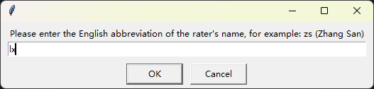
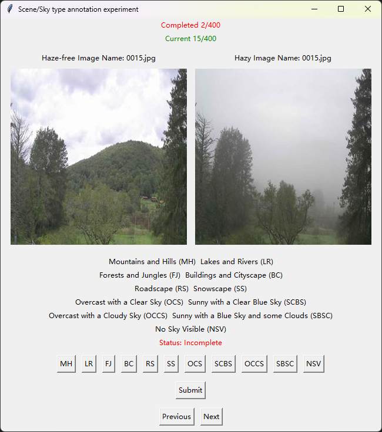
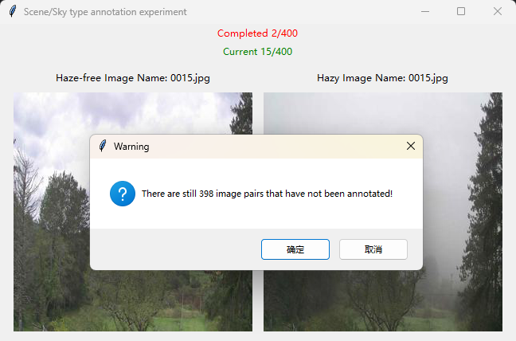

### RWIDE Annotation Guidance

Image dehazing is a meaningful but ill-posed task aimed at generating clear images from hazy ones. However, existing research often relies on synthetic or artificial-haze image datasets, limiting their applicability to real-world scenarios. Existing natural-haze datasets also lack diversity and sufficient pairs of hazy and haze-free images. To address these limitations, we introduce the **R**eal-**W**orld **I**mage **DE**hazing dataset (RWIDE), the first large-scale hazy image dataset with multi-scene annotations, containing 2,455 image pairs. It comprises six haze scene types and five sky region types. Annotators are encouraged to thoroughly analyze the content of image pairs and adhere to the provided guidelines to effectively perform the task of type-tagging this dataset. The specific instructions are outlined as follows:

#### Labels

Ground scene classification:
1. Mountains and Hills (MH)
2. Lakes and Rivers (LR)
3. Forests and Jungles (FJ)
4. Buildings and Cityscape (BC)
5. Roadscape (RS)
6. Snowscape (SS)

Sky scene classification:

1. No Sky Visible (NSV)
2. Overcast with a Clear Sky (OCS)
3. Sunny with a Clear Blue Sky (SCBS)
4. Overcast with a Cloudy Sky (OCCS)
5. Sunny with a Blue Sky and some Clouds (SBSC)

#### Labeling Standard

1. Scene classification depends on the location where haze is present. Haze manifests in various formations and distributions across different settings, creating unique hazy landscapes. RWIDE categorizes ground scenes into six groups: Mountains and Hills (MH), Lakes and Rivers (LR), Forests and Jungles (FJ), Buildings and Cityscape (BC), Roadscape (RS), and Snowscape (SS). Due to potential overlap, scene classifications are interconnected, allowing for **multiple selections**.
2. Sky-type classification is based on the sky conditions depicted in haze-free images. Despite the absence of haze in these scenes, the sky may exhibit various states, such as clear blue, cloudy, or overcast. In RWIDE, the skies depicted in haze-free images are categorized into five types: No Sky Visible (NSV), Overcast with a Clear Sky (OCS), Sunny with a Clear Blue Sky (SCBS), Overcast with a Cloudy Sky (OCCS), and Sunny with a Blue Sky and some Clouds (SBSC). Sky type classifications are independent, allowing only **single selection** for sky points.

#### Tips

1. Maintain a quiet, objective, independent, and rigorous approach throughout the labeling process! Disable copying and pasting!
2. Stay focused and ensure accurate labeling of the dataset during the labeling process.
3. Complete labeling for all options of each image pair before submission, and proceed to annotate the next pair.
4. Allocate 1-2 hours per day for labeling, balancing work and leisure to prevent fatigue from affecting labeling accuracy.
5. Annotators are encouraged to ask questions at any time if clarification is needed.

#### Requirements for Annotators

1. Labelers need to have good mental health and have a more mature understanding and discrimination of emotions.
2. Labeling personnel must conscientiously and responsibly label each image pair, and are prohibited from labeling indiscriminately. Violations will result in disqualification from labeling and forfeiture of corresponding remuneration.
3. Possess strong work literacy, effectively manage time, and complete labeling tasks within the designated timeframe.

#### Experimental Procedure:

1. Run *annotation_experiment.exe* to start the experiment.

2. Input the nickname of the annotator for recording purposes.

   

3. Provide annotations based on the content of the displayed haze-free and hazy images. Scene classifications (MH, LR, FJ, BC, RS, and SS) are interrelated due to potential overlap. If a specific scene element is present, select the corresponding button. **Multiple selections are allowed for scene classification.** However, sky type classifications (NSV, OCS, OCCS, SCBS, and SBSC) are independent, **allowing only single selection for sky points.**

   

4. Closing the program without completing the experiment will result in a warning message.

   